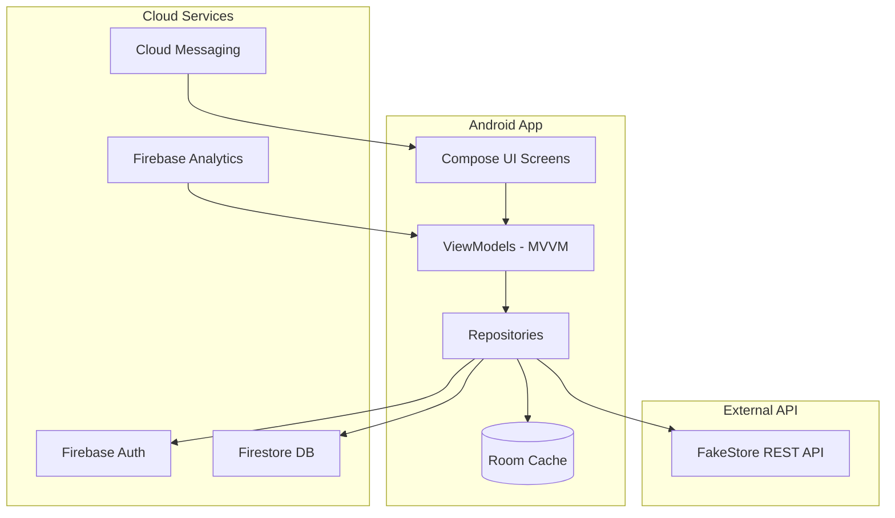

# Architecture Documentation

## System Overview



## Layer Architecture

```
┌─────────────────────────────────────────┐
│           Presentation Layer            │
│  (Compose Screens, Navigation, Theme)   │
├─────────────────────────────────────────┤
│           ViewModel Layer               │
│  (MainViewModel, StateFlow, Events)     │
├─────────────────────────────────────────┤
│           Repository Layer              │
│  (Auth, Product, Order, Customer,       │
│   Analytics Repositories)               │
├─────────────────────────────────────────┤
│           Data Sources                  │
│  Room DB │ Firestore │ Retrofit API     │
└─────────────────────────────────────────┘
```

## RBAC Permission Matrix

| Feature | Customer | Manager | Admin |
|---|:---:|:---:|:---:|
| Browse Products | ✅ | ✅ | ✅ |
| Place Orders | ✅ | ✅ | ✅ |
| Manage Order Status | ❌ | ✅ | ✅ |
| View Customers | ❌ | ✅ | ✅ |
| Analytics Dashboard | ❌ | ✅ | ✅ |
| Sync Products from API | ❌ | ❌ | ✅ |

## Data Flow – Order Placement

```
Customer taps "Buy"
    → MainViewModel.placeOrder()
    → OrderRepository.placeOrder()
        → Room: insert OrderEntity (cache)
        → Firestore: add to orders collection
    → Real-time listener updates all connected clients
    → FCM notification (optional, from backend)
```

## Firestore Collections

| Collection | Document Fields |
|---|---|
| `users` | email, name, role |
| `orders` | customerId, customerName, productTitle, quantity, totalAmount, status, createdAt |
| `products_sync` | count, syncedAt |

## Room Tables

| Table | Purpose |
|---|---|
| `products_cache` | Offline product catalog |
| `orders_cache` | Offline order history |
| `analytics_cache` | Cached dashboard metrics |

## Security Measures

1. **Network Security Config** – Cleartext traffic disabled
2. **ProGuard/R8** – Code obfuscation in release builds
3. **RBAC** – Role checks before sensitive operations
4. **Firebase Auth** – Secure token-based authentication
5. **HTTPS** – All API calls over TLS

## Performance Optimizations

1. Room caching minimizes network requests
2. Flow + StateFlow for reactive, lifecycle-aware UI
3. LazyColumn for efficient list rendering
4. Coil image loading with caching
5. Firestore snapshot listeners for efficient real-time sync

## Deployment Workflow

```
Development → Debug APK Testing → Release Build (ProGuard)
    → Signed APK/App Bundle → Firebase App Distribution / Play Store
```
